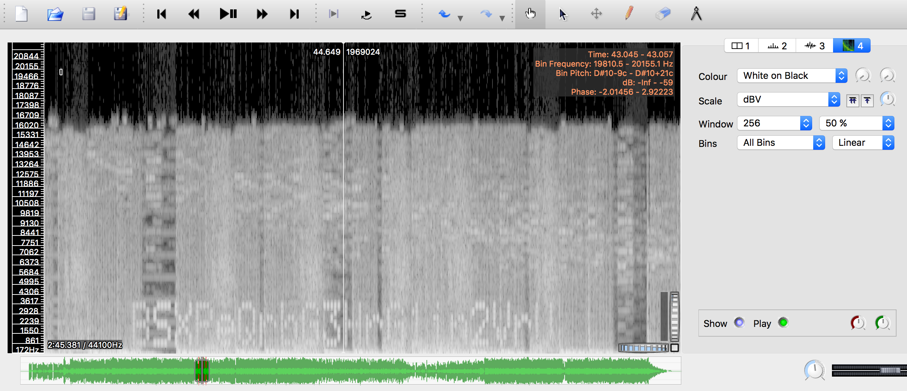
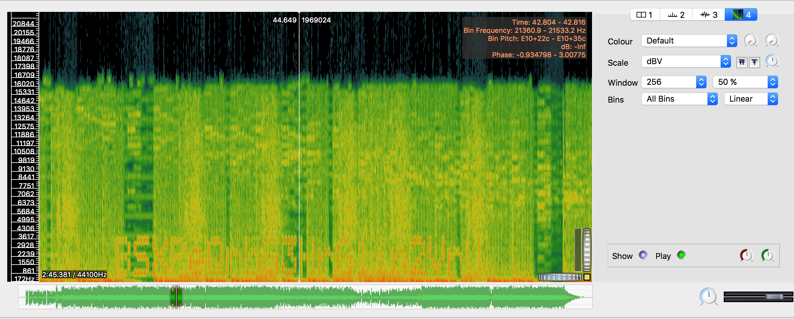
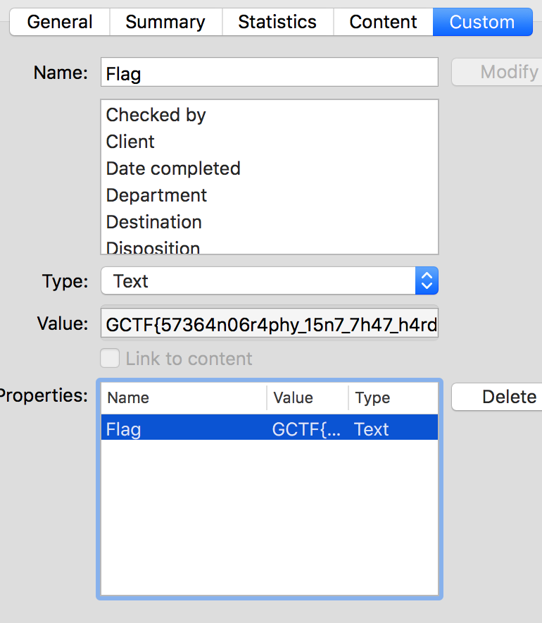

# GryphonCTF_2016: Mr Robot

**Category:** Forensics
**Points:** 35
**Description:**

>The sound is so deep for elliot
[Alternative (Faster) Download Link](https://mega.nz/#!TR43nJoL!Rly3xxxBuA9SlWbRAW-mNjn4_8ZfgYjMuEjNCD2r0y8)
WARNING: 63 MB file
Creator - Darren Ang (@Southzxc)

## Write-up
_No files provided as it's a really big file._
Download the file, ignore everything else. Extract the two WAVs and load the 58.3MB wav into SonicVisualiser. You see those two spikes? Well, don't worry. Add a spectrogram pane and look for the red lines in the timeline. Scroll to the red lines, zoom in, set window to 256 and 50% and viola, you found text.

Upon tireless copying, we get the password, `BSXPeQrbG3HrG1in2VrU`.

Opening the other WAV file in SonicVisualiser though, reveals nothing. Hmm... _Sound is so deep for elliot... Mr Robot_... Wait a second. _I've never watched Mr Robot in my life_ but maybe googling 'Mr Robot WAV Steganography' will reveal something? Couple of searches later, we end up with a tool called DeepSound.

Putting the password into DeepSound and the 2nd WAV file, we get a hidden .DOCX file. Extracting it and opening it up gives us a cryptic `The flag is not here, look harder`. Opening Properties and going into Custom, we see a Flag property. Viola.

Therefore, the flag is `GCTF{57364n06r4phy_15n7_7h47_h4rd}`.
