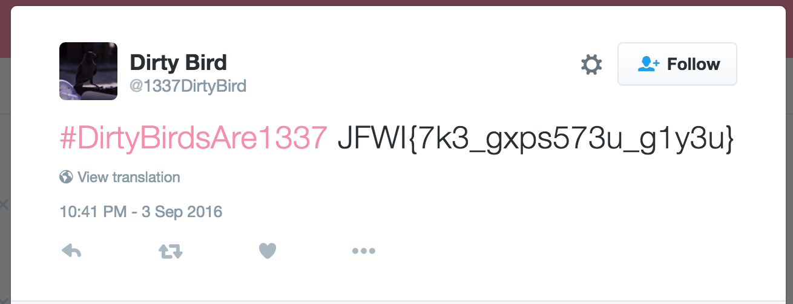

# GryphonCTF_2016: Dirty Bird

**Category:** Misc
**Points:** 20
**Description:**

>You found a dirty ol' square piece of black paper with a QR code on it, naturally, you become curious... Should you scan it?
Creator - Shawn Pang (@Optixal)

**Hint:**

>

## Write-up
Definitely, you should scan it. Till you realize you cannot.

Invert the image, black = white, white = black, scan it. You get an integer `234469727479426972647341726531333337`, what the hell? Oh wait, it's a hex-encoded string. Convert it to string using a tool like `echo 234469727479426972647341726531333337 | xxd -r -p`. You get `#DirtyBirdsAre1337` from the previous step. What's this? A pound sign? No stupid, it's a hashtag!

Searching it up in Twitter, gets you

`JFWI{7k3_gxps573u_g1y3u}`. This looks suspiciously like a flag format, so we run it through the easiest decode algorithm, called ROT. On ROT-23, yuo get `GCTF{7h3_dump573r_d1v3r}`.

Therefore, the flag is `GCTF{7h3_dump573r_d1v3r}`.