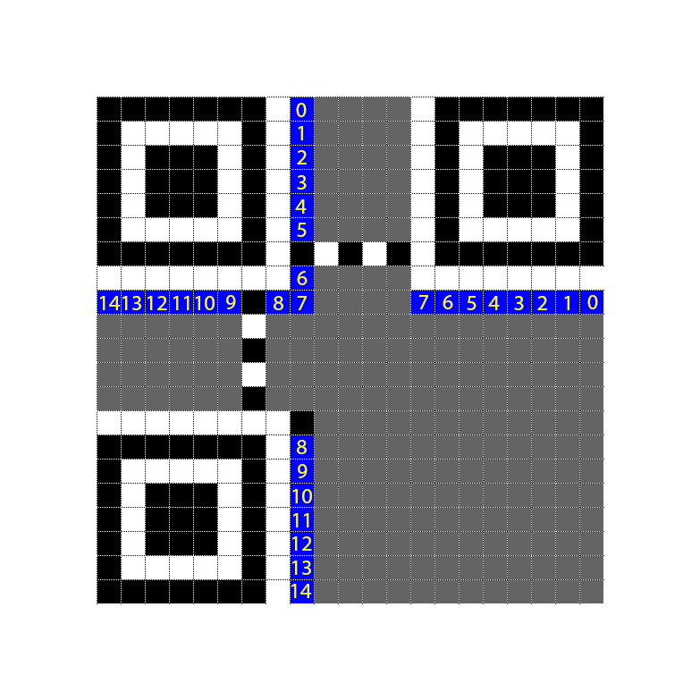

# GryphonCTF_2016: I Need You

**Category:** Misc
**Points:** 25
**Description:**

>I need you to fix my QR code for me pls! This may help: 00010
Creator - Shawn Pang (@Optixal)

**Hint:**

>

## Write-up

***Credits to @zst123 [Manzel Seet] for eliminating the original possibilities(hahaha).***

We are given a [broken QR code](original.png).
`00010` refers to the format string, with error correction M and mask pattern 2 `(column) mod 3 == 0`.
Generator polynomial is `10100110111`.

Firstly, we need to pad the format string on the right with zeroes till the length of 15, then we need to remove the zeroes on the lefs.

    format =    00010
    format =    000100000000000
    format =    100000000000

Then, we need to pad the generator polynomial till the same length as the format.

    generator = 10100110111
    generator = 101001101110

Next, we have to xor it.

    product = 101001101110 ^ 100000000000
    product = 001001101110
    product = 1001101110

As the resulting product is `10` bits, we can stop here. Now we can join the previous format bit string with the product string,

    combined = format + product
    combined = 00010 + 1001101110
    combined = 000101001101110

Lastly, we need to XOR it again,

    final = combined ^ 101010000010010
    final = 000101001101110 ^ 101010000010010
    final = 101111001111100

Using the table below, we can now encode this last final format/mask string into our QR code.

| 14 | 13 | 12 | 11 | 10 | 9  | 8  | 7  | 6  | 5  | 4  |  3 | 2  | 1  | 0  |
|----|----|----|----|----|----|----|----|----|----|----|----|----|----|----|
| 1  | 0  | 1  | 1  | 1  | 1  | 0  | 0  | 1  | 1  | 1  | 1  | 1  | 0  | 0  |

Hm... it still doesn't scan... We go back to our table of [format version table](http://www.thonky.com/qr-code-tutorial/format-version-tables). Searching for the initial hint, we get `000100000111011`. Pattern 7, with ECC H.

| 14 | 13 | 12 | 11 | 10 | 9  | 8  | 7  | 6  | 5  | 4  |  3 | 2  | 1  | 0  |
|----|----|----|----|----|----|----|----|----|----|----|----|----|----|----|
| 0  | 0  | 0  | 1  | 0  | 0  | 0  | 0  | 0  | 1  | 1  | 1  | 0  | 1  | 1  |

Encoding it again this time around with the new format/mask string, we get this QR code.

 

Scanning it, gives us the flag. We had done all the math for nothing. T.T

Therefore, the flag is `GCTF{w3lc0m3_70_7h3_m47r1x}`.
