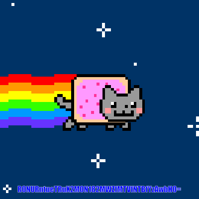

# GryphonCTF_2016: Nyan cat is on the loose!

**Category:** Misc
**Points:** 10
**Description:**

>Nyan Cat!
Creator - Darren Ang (@txsouth)

**Hint:**

>

## Write-up
This is a simple one again, you just need to know how to split GIF files into their respective frames. [One tool that helps is this site.](http://ezgif.com/split/5793fd905e.gif). On the 6th frame, you get a picture like this

On it, appears to be `R0NURntueTRuX2M0N182MWZfMTVfNTBfYzAwbH0=`

Converting it from base64 -> ascii gives us `GCTF{ny4n_c47_61f_15_50_c00l}`.

Therefore, the flag is `GCTF{ny4n_c47_61f_15_50_c00l}`.