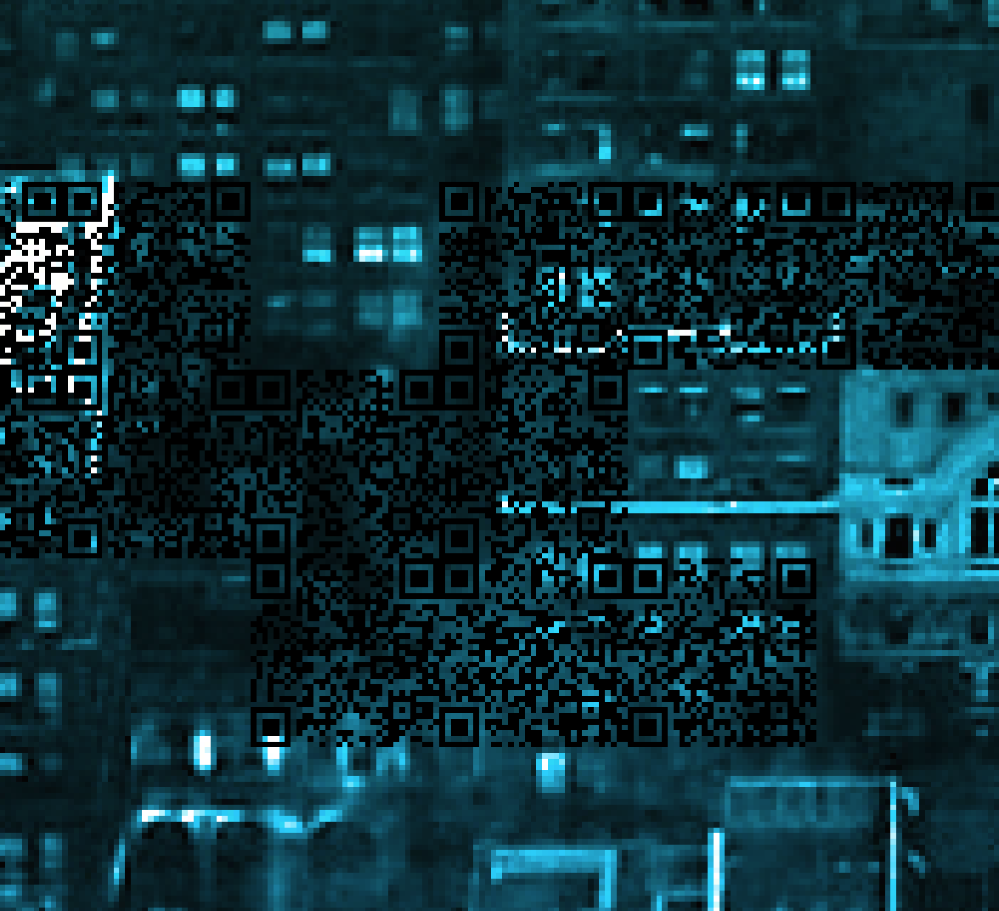
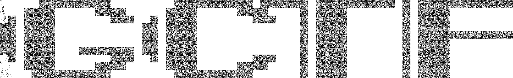

# GryphonCTF_2016: Hide and Seek

**Category:** Programming
**Points:** 30
**Description:**

>Welcome to Hide and Seek.
Hiders code to hide, seekers seek to capture the flag.
Are you a hider or a seeker?
(https://youtu.be/B4pWdmaCO0Q?list=RDB4pWdmaCO0Q)
~ if you're up for some Nerve vibes ~
Creator - Shawn Pang (@Optixal)

## Write-up
We are given an image.

Holy shit.
Did you see that? Is that...

You cannot be serious. No you cannot be.

Well, thankfully, I am not. This is a programming question after all! We know two things, firstly, we have a ***shit*** ton of QR codes and that we cannot possibly scan them all. So, we take advantage of our l33t skills and do a few things.

Firstly, we want to separate out the QR codes and crop out all the spam. You can use anything to do this, Photoshop or Preview.

Nice, then we need to think, if each QR code is `33x33` and that we have a size of `330x2145`. So we have an approximate `650` QR codes to actually manually scan but since we are l33t people, we do not. We can take advantage of libraries like [Pillow](https://pillow.readthedocs.io) and [zbarlight](https://github.com/Polyconseil/zbarlight).

[After coding a script,](script.py) and running it,

    $ ./script.py
    QR: GCTF{w3_h4v3_f0und_y0u_!}

Therefore, the flag is `GCTF{w3_h4v3_f0und_y0u_!}`.
[Full script found here.](script.py)
