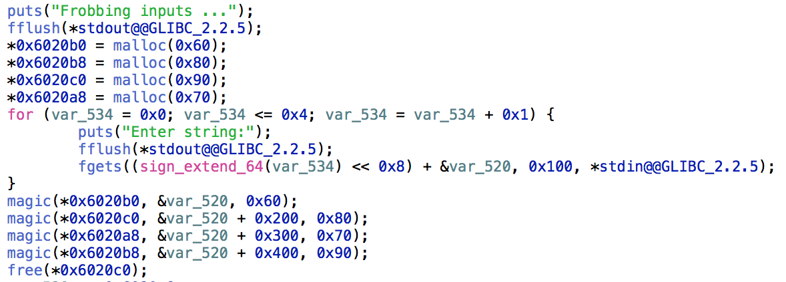

# CrossCTF_2017: Patching Frobnicator

**Category:** Defense
**Points:** 150
**Description:**

>Patch the frobnicator!
Use the following command
curl -v -F secretKey=@localFile 192.168.0.30:8080/api/frobnicator
[Binary to patch here](frobnicator_wm)

## Write-up
Relatively simple to patch this one, as the vulnerability is spawned by a typo in the malloc. To solve, simply patch it by swapping the size argument of the `magic()` function of `0x6020c0` and `0x6020b8`.

[Solution](frobnicator_wm_patched).
