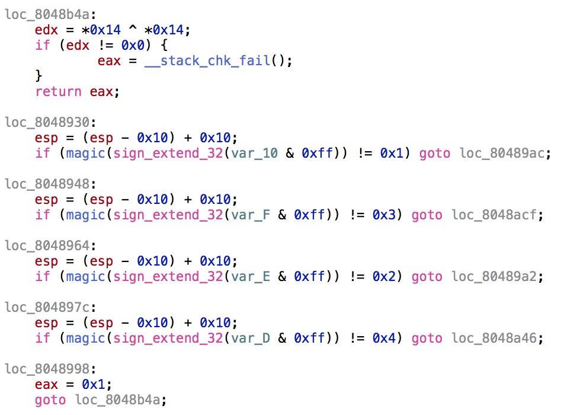

# CrossCTF_2017: Sky Pillar 3

**Category:** Reverse Engineering
**Points:** 300
**Description:**

>192.168.0.31:1350 Please start from level 01

## Write-up
This one requires more reverse engineering skill than the previous one. A pseudo-code is also helpful in this case.

In general, the objective is to get back to `0x8048b4a` with an `eax` value of `1`. This means we have to get to `0x8048998`. In order to do that, we must travel down from `0x8048930` and in order to get to `0x8048930`, we need `eax` to have a value of `2` such that it jumps from `0x8048906`. This means, our arguments has to have 5 values, all of which once magicked should have a value of `2`, `1`, `3`, `2` and `4`.

Now that we have the logistics out of the way, let's look at `magic()`. After awhile of digging, it's just a glorified bit counter, counting the amount of `1`s in a character byte. As such, we can just [replicate it in Python](solve.py).

    $ ./solve.py 
    Flag: 0 @ C D G

    $ ./skypillar
                                     Welcome to                                    
     ______     __  __     __  __        ______   __     __         __         ______     ______
    /\  ___\   /\ \/ /    /\ \_\ \      /\  == \ /\ \   /\ \       /\ \       /\  __ \   /\  == \
    \ \___  \  \ \  _"-.  \ \____ \     \ \  _-/ \ \ \  \ \ \____  \ \ \____  \ \  __ \  \ \  __<
     \/\_____\  \ \_\ \_\  \/\_____\     \ \_\    \ \_\  \ \_____\  \ \_____\  \ \_\ \_\  \ \_\ \_\
      \/_____/   \/_/\/_/   \/_____/      \/_/     \/_/   \/_____/   \/_____/   \/_/\/_/   \/_/ /_/
    ================================================================================
                        Home of the legendary Pokemon, Rayquaza                          
    ================================================================================
    There are 5 Levels to climb. Each level requires a specifc code to unlock the next level.
    Your goal is to reach the top, and catch the legendary Rayquaza... Good luck!
    ====================================================================
                              LEVEL 01                                  
    ====================================================================
    Enter code: I w@nn@ be the very best
    CrossCTF{xxxxxxxxxxxxxxxxx}
    ====================================================================
                              LEVEL 03                                  
    ====================================================================
    Enter Code: 0 @ C D G
    CrossCTF{xxxxxxxxxxxxxxxxx}

Therefore, the flag is ``.
