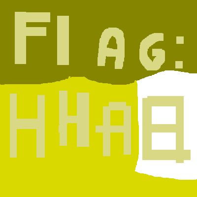

# HSCTF_2017: Basic Bucketfill

**Category:** Forensics
**Points:** 100
**Description:**

>Keith is in a contest with another colleague, to see who can find the hidden message [in the picture](original.png). However, they're only allowed to use the most basic editing tools!
Can you find out the secret message? 

## Write-up
We are given a horrible MS Paint job

If we tweak the colours a bit, we get something more legible

Therefore, the flag is `HHA8`.