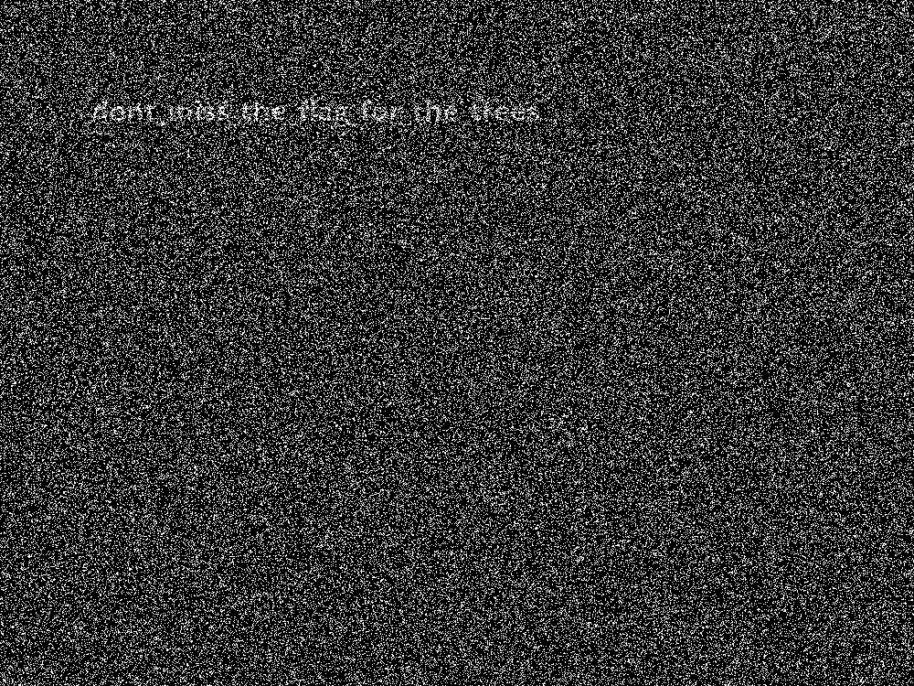
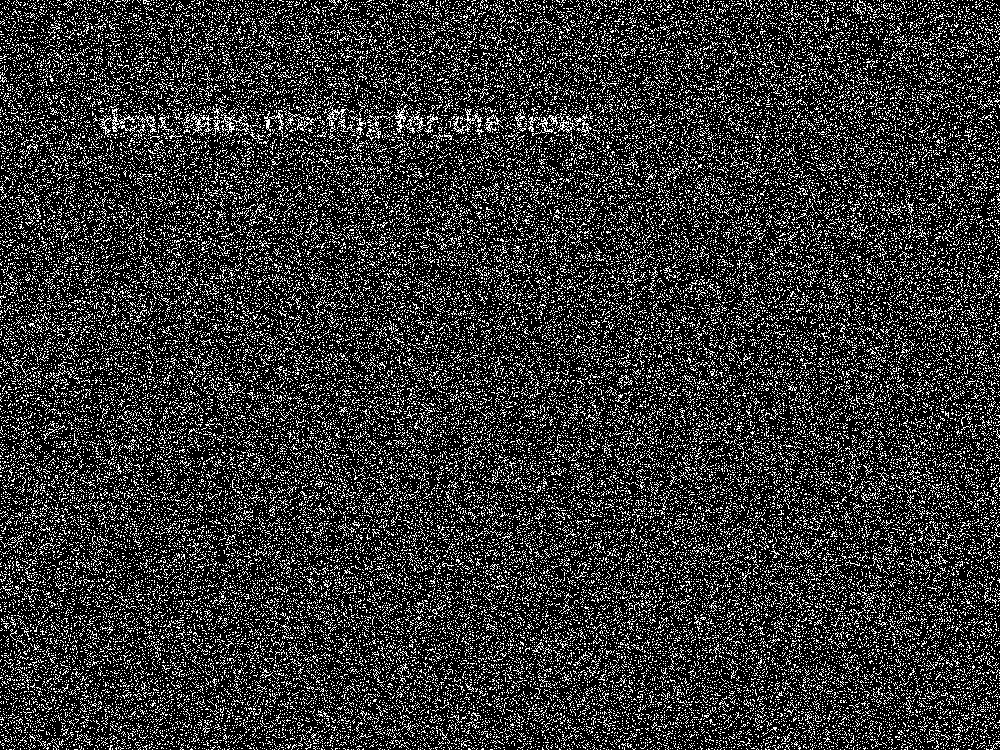
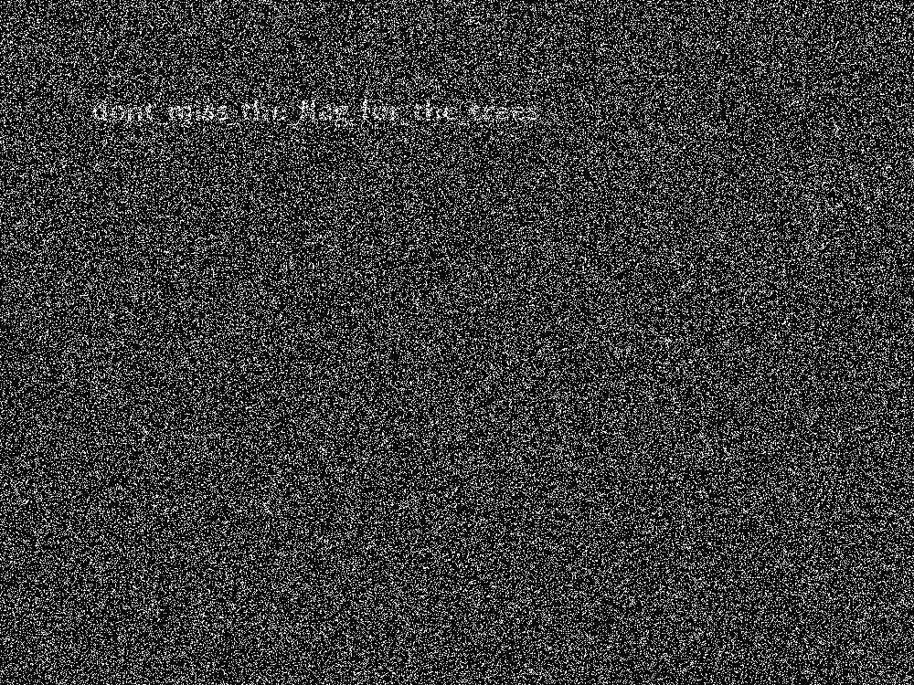

# PACTF_2017: Bitesized

**Category:**
**Points:** 80
**Description:**

>There’s an image of some trees here. I bet the image contains more than trees, though. [trees.png](trees.png)

**Hint:**

>Try mod 8?

## Write-up
Stegsolver is very useful for this, as we take a look at the plane 2s.

If you squint hard enough, you can barely make out the flag.

Therefore, the flag is `dont_miss_the_flag_for_the_trees`.