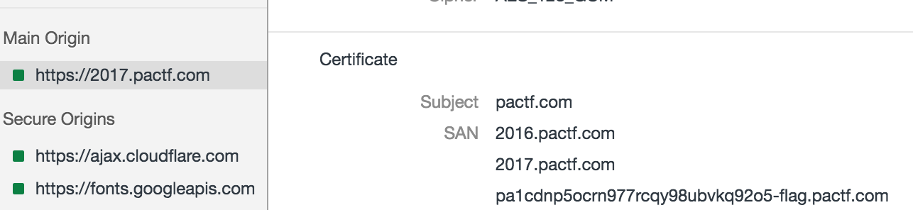

# PACTF_2017: CT S(C)AN

**Category:**
**Points:** 35
**Description:**

>CHECK THE SAN. MAYBE CT SCANS ARE USEFUL TOO.

**Hint:**

>We are a security competition, not a hospital. Consult with your healthcare professional before deciding to take any CAT scans.

## Write-up
This challenge is a real troll to anyone who hasn't done SSL security before. SAN, stands for ` Subject Alternative Name`.

Looking into the security section of the browser, you find that the SANs are all listed there, including our flag.

Therefore, the flag is `pa1cdnp5ocrn977rcqy98ubvkq92o5-flag.pactf.com`.