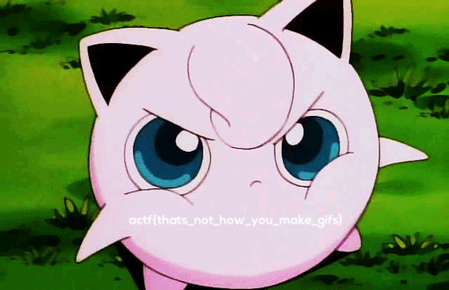

# AngstromCTF_2018: gif

**Category:** Misc
**Points:** 50
**Description:**

>Making a [gif](jiggs.gif) is so hard.

## Write-up
For this challenge, we can simply use the tool `foremost` to extract all the PNG files from the image. We get our flag in the `output/png` folder.

Therefore, the flag is `actf{thats_not_how_you_make_gifs}`.
