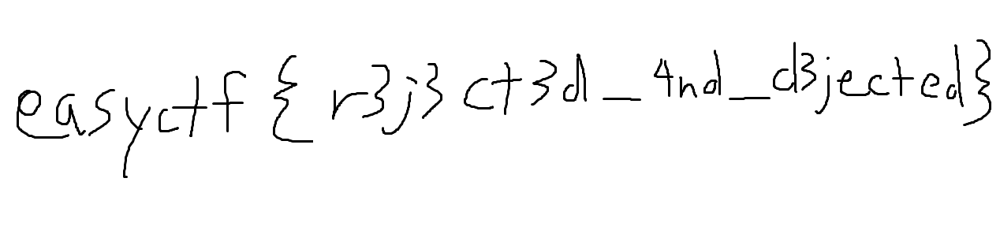

# EasyCTF_2018: The Letter

**Category:** Forensics
**Points:** 80
**Description:**

>I got a letter in my email the other day... It makes me feel sad, but maybe it'll make you glad. :( [file](myletter.docx)

## Write-up
This challenge was relatively simple as well, just renaming the file to `.zip` and extracting it reveals a `template.png` below. For people having issues with unzipping it, try using the Linux commands instead, like `$ unzip myletter.docx -d myletter/`

Therefore, the flag is `easyctf{r3j3ct3d_4nd_d3jected}`.
