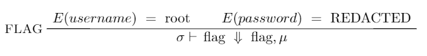

# EasyCTF_2018: Little Language

**Category:** Miscellanous
**Points:** 250
**Description:**

>I want root access to this special programming portal, and this file is my only clue. Maybe the password is inside? Even if it is, I'm not sure how to enter it. [encrypted](encrypted)
`nc c1.easyctf.com 12480`
Oh! Almost forgot... this might [help](help).

## Write-up
This challenge was fantastically annoying. Firstly, to start off with, the creator is @ztaylor54. A little googling leads us to his portfolio [site](https://ztaylor54.com/). On there, you find a suspicious link and reference to `5ive`.

A little bit more googling and we land on this GitHub page for [5ive1terpreter](https://github.com/eherbert/5ive1terpreter). In this [file](https://github.com/eherbert/5ive1terpreter/blob/master/1nterpreter/Parser.y#L95), we see something highly familiar.

    Stmt
      : Expr                                { NodeE $1 }
      | alive var '=' Expr                  { NodeLet $2 $4 }
      | unded var '=' Expr                  { NodeRecLet $2 $4 }
      | class cname "{" fields VList "..." MList "}"    { NodeClass $2 $5 $7 }
      | class cname extends cname "{" fields VList "..." MList "}"    {NodeClassExtends $2 $4 $7 $9 }

Going back to the files we got, 

Hmm... That certainly looks suspicious. Maybe the variables were renamed?

    # nc c1.easyctf.com 12480
    ctflang
    commands begin with ":" (try :help)
    global tag = 2
    tag
    2

Bingo! Now we know what sets the variable, let's try and look at the image above. What does that mean? Well, according to the [PDF file](https://github.com/eherbert/5ive1terpreter/blob/master/5ive_LanguageSpecification.pdf), it seems to be some form of expression semantics. Let's get back to it later. To get the password, just `strings`.

    # strings encrypted
    [...]
    zQYY
    (1 ???99
    %5)r
    ,..6
    MbUU
    <x0y
    IEND
    note: the password is l7&4C&Cg

Now, let's try to get the flag, which according to the expression semantic, is a function.

    # nc c1.easyctf.com 12480
    ctflang
    commands begin with ":" (try :help)
    global username = "root"
    global password = "l7&4C&Cg"
    flag
    EasyCTF{5m4ll_573p_53m4n71c5_4r3_fun_r16h7?}

Therefore, the flag is `EasyCTF{5m4ll_573p_53m4n71c5_4r3_fun_r16h7?}`.
